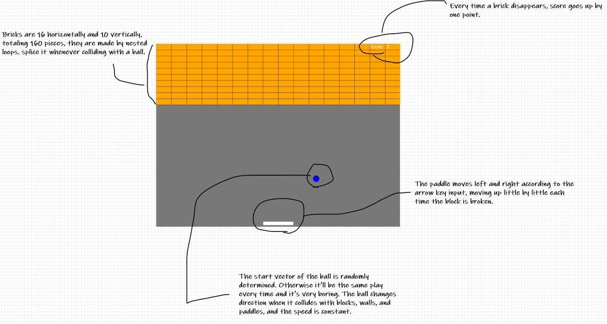

## High Concept.
* * *
This is like the 29th assignment, _"paddle_ball_exercise"_, which is a bit more developed.

So I decided to make _brick breaker_, One of my favorite game.
* * *

## Theme
* * *
The theme is __"review"__.

I know that there are tons of more fun games in the world. 

However, my programming skills still need to improve and I wanted to use what I learned comprehensively, so I made this game with using of what I learned.

* * *
## Mocks Up
***

***